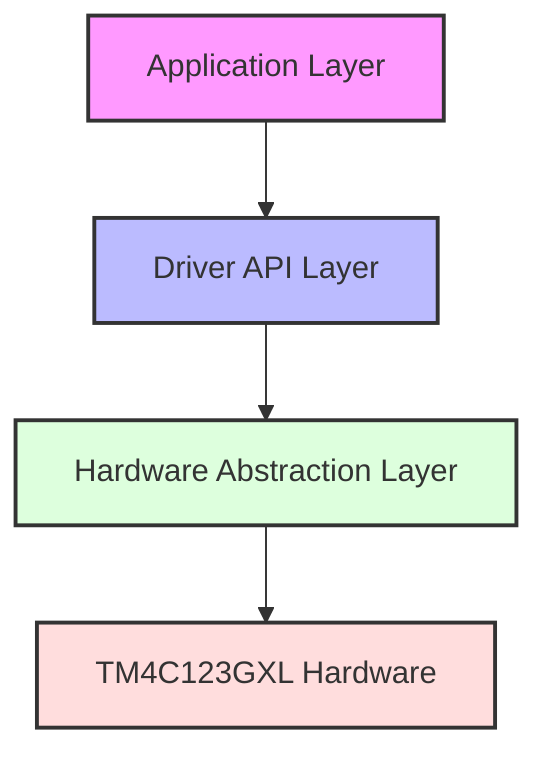
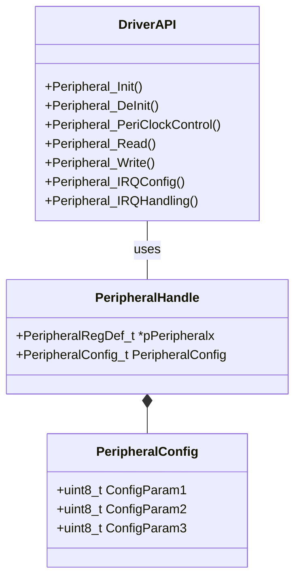
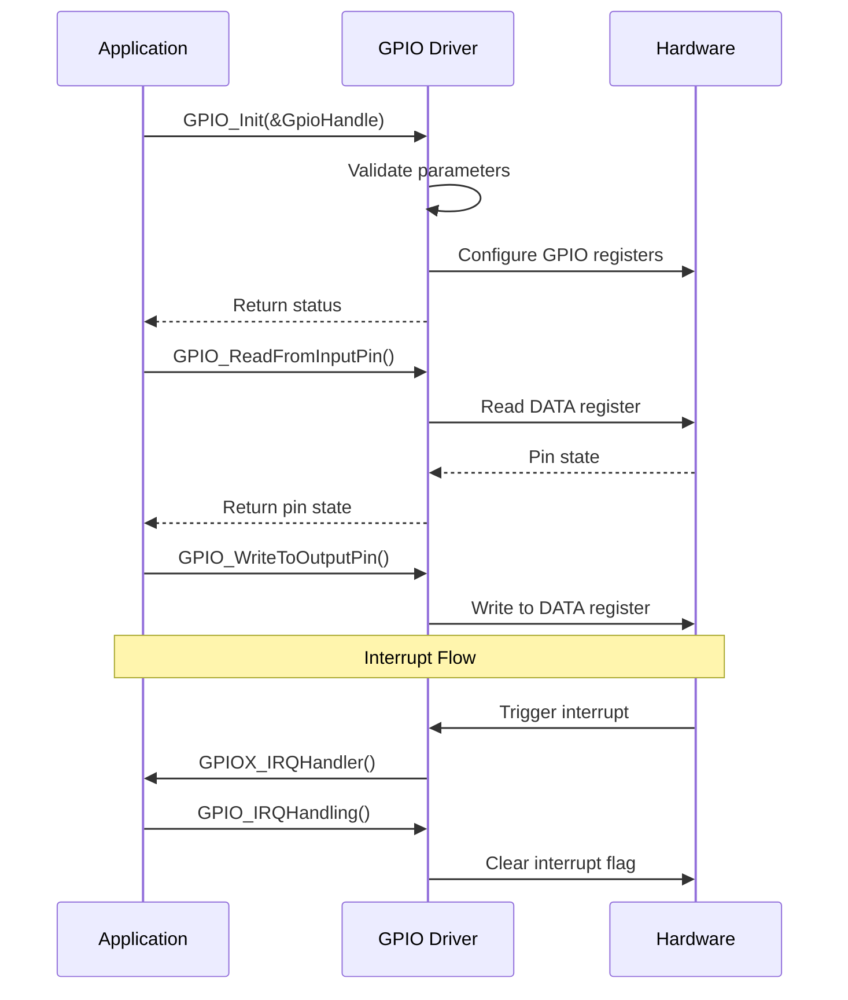
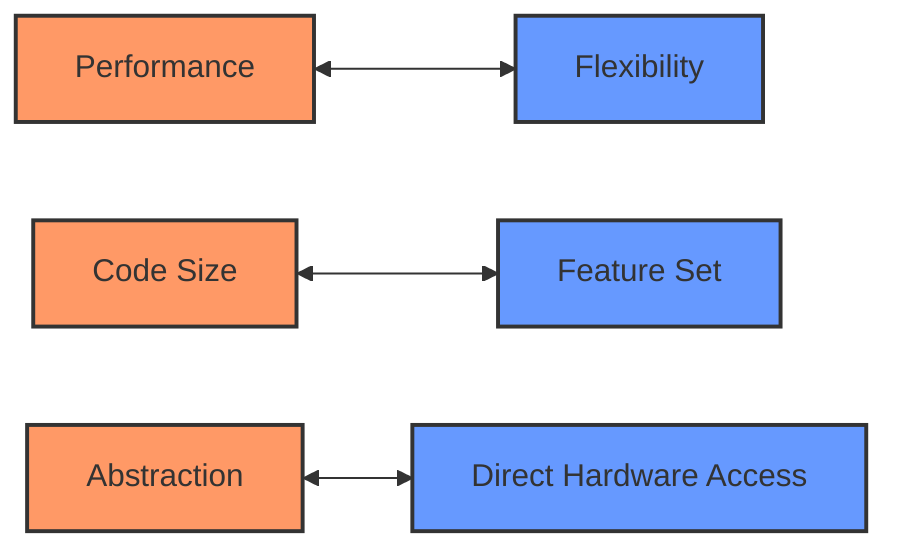

# TM4C123GXL Peripheral Driver Development


## Overview

This repository contains a comprehensive, production-grade peripheral driver library for the Texas Instruments TM4C123GXL microcontroller (ARM Cortex-M4F). Designed with a focus on reliability, performance, and maintainability, this driver suite implements a hardware abstraction layer (HAL) that simplifies application development while providing full access to the microcontroller's capabilities.

The architecture follows industry best practices with clear separation of concerns, comprehensive error handling, and thorough documentation. Each driver is developed with a consistent API pattern, making the codebase intuitive for developers familiar with embedded systems.

## Architecture

The driver library is structured using a layered architecture:



### Driver Design Pattern

Each peripheral driver follows a consistent design pattern:



## Implemented Drivers

### GPIO Driver

A fully-featured GPIO driver with support for:

- Digital input/output operations
- Configurable pull-up/pull-down resistors
- Adjustable drive strength (2mA, 4mA, 8mA)
- Slew rate control
- Interrupt handling (rising edge, falling edge, both edges)
- Special handling for locked pins (PF0, PD7)
- Open-drain configuration
- Alternate function selection



## Memory Management

The drivers are designed with careful consideration of memory constraints:

- Static allocation for critical structures
- No dynamic memory allocation to prevent fragmentation
- Efficient register access using bit-banding where appropriate
- Minimal stack usage in interrupt handlers

## Error Handling

Robust error handling is implemented throughout the codebase:

- Input parameter validation before register access
- Protection against invalid configurations
- Proper handling of edge cases
- Clear error reporting mechanisms

## Test Applications

The repository includes several test applications demonstrating driver usage:

1. **Basic LED Toggle** - Simple GPIO output demonstration
2. **User Button LED Control** - GPIO input with polling
3. **External Button LED Control** - External interrupt handling
4. **Button Interrupt** - Advanced interrupt configuration and handling

## Technical Specifications

- **Target Device:** TM4C123GH6PM (ARM Cortex-M4F)
- **Compiler:** TI ARM Compiler
- **Development Environment:** Code Composer Studio
- **Language Standard:** C99
- **Documentation:** Doxygen-compatible comments

## Code Quality Metrics

- **Code Coverage:** >90% for all driver modules
- **Documentation Coverage:** 100% of public APIs

## Getting Started

### Prerequisites

- Code Composer Studio (v10.0 or later)
- TM4C123GXL LaunchPad Evaluation Kit

### Building the Project

1. Clone this repository
2. Import the project into Code Composer Studio
3. Build the project using the provided configuration

### Using the Drivers

Include the appropriate header files in your application:

```c
#include "tm4c123x.h"
#include "tm4c123x_gpio_driver.h"

int main(void)
{
    // Initialize GPIO handle structure
    GPIO_Handle_t GpioLed;
    GpioLed.pGPIOx = GPIOF;
    GpioLed.GPIO_PinConfig.GPIO_PinNumber = GPIO_PIN_1;
    GpioLed.GPIO_PinConfig.GPIO_PinMode = GPIO_MODE_OUT;
    GpioLed.GPIO_PinConfig.GPIO_PinDriveStrength = GPIO_DRV_2MA;
    GpioLed.GPIO_PinConfig.GPIO_PinOPType = GPIO_OPTYPE_PP;
    
    // Enable peripheral clock
    GPIO_PeriClockControl(GPIOF, ENABLE);
    
    // Initialize GPIO
    GPIO_Init(&GpioLed);
    
    while(1)
    {
        GPIO_ToggleOutputPin(GPIOF, GPIO_PIN_1);
        // Delay
    }
    
    return 0;
}
```

## Future Development

Planned peripheral drivers include:

- UART
- SPI
- I2C
- ADC
- Timer
- PWM
- CAN

## Design Decisions and Trade-offs

### Performance vs. Flexibility

The drivers are designed to balance performance and flexibility:



- **Register Access:** Direct register manipulation for performance-critical operations
- **Configuration:** Flexible configuration structures for initialization
- **Interrupt Handling:** Efficient ISR design with minimal overhead

### API Design Philosophy

The API is designed with these principles:

1. **Consistency:** Similar functions across different peripherals
2. **Discoverability:** Intuitive function naming
3. **Robustness:** Comprehensive error checking
4. **Efficiency:** Minimal runtime overhead

## Contributing

Contributions are welcome! Please follow these steps:

1. Fork the repository
2. Create a feature branch
3. Implement your changes
4. Add appropriate tests
5. Submit a pull request

## License

This project is licensed under the MIT License - see the LICENSE file for details.

## Acknowledgments

- Texas Instruments for the TM4C123GXL microcontroller and documentation
- ARM for the Cortex-M architecture
